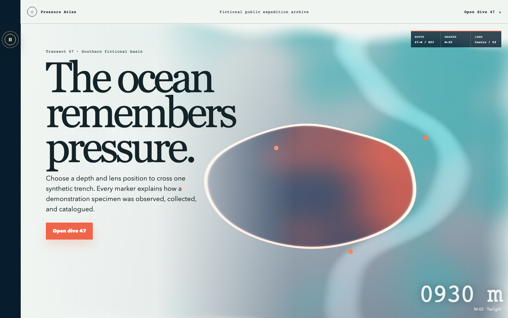
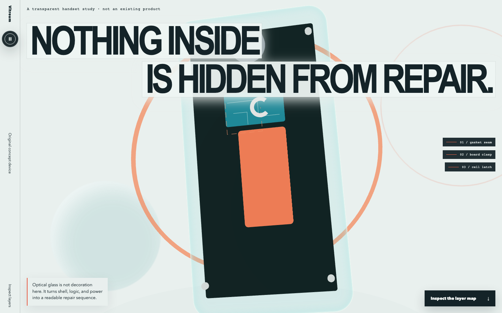
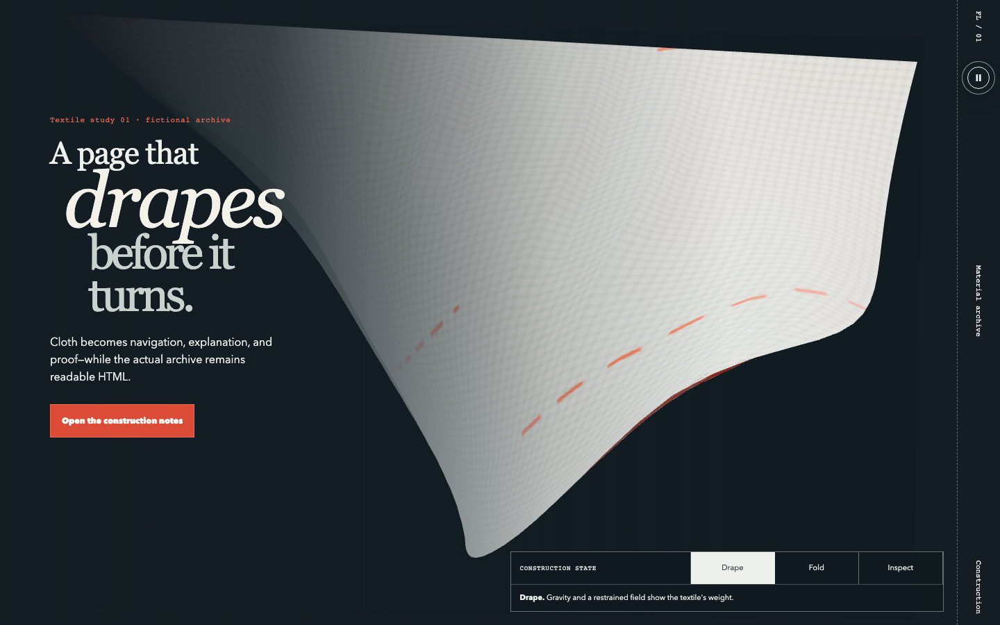

# DEMETA Frontend

An open-source Codex skill for building authored, studio-grade web experiences with real art direction, material motion, semantic fallbacks, and evidence-based release gates.

DEMETA is deliberately not a generic landing-page generator. It is for flagship work where the interface needs a memorable physical or spatial idea—fluid flow, optical glass, cloth, procedural fields, Three.js/WebGL/WebGPU, shaders, canvas, SVG, generated media, or another medium justified by the subject.



## What changed

The original skill was a 556-line taste manifesto with a phrase-presence verifier. The rewrite turns it into a compact router plus enforceable contracts:

- 11-field design fingerprints and adversarial anti-template tests;
- a versioned `demeta.manifest.json` schema and deterministic evaluator;
- WCAG 2.2 AA, keyboard, reduced-motion, reflow, and canvas-alternative gates;
- initial JS, enhanced route JS, CSS, media, DPR, draw-call, triangle, LCP, CLS, and TBT budgets;
- Three.js/WebGL/WebGPU lifecycle, context-loss, disposal, and low-power rules;
- fluid, optical-glass, cloth/Verlet, shader, SVG, Canvas 2D, and Web Audio guidance;
- claim ledger that blocks invented proof in production;
- generated/owned/licensed/original-code asset provenance;
- desktop, mobile, interaction, reduced-motion, and no-WebGL browser evidence.

The full before/after findings are in [docs/AUDIT.md](docs/AUDIT.md). The evaluator design is in [docs/EVALUATION.md](docs/EVALUATION.md).

## Showcase

Three original fictional studies prove different material systems. They are examples of reasoning and engineering, not templates to reskin.

**[Open the live interactive showcase](https://demetacrypto.github.io/demeta-frontend/)** — use the depth/lens controls, inspect the transparent device layers, and switch the cloth between drape, fold, and inspection modes.

| Study | Signature medium | Purpose |
|---|---|---|
| [Pressure Atlas](https://demetacrypto.github.io/demeta-frontend/pressure-atlas/) | Three.js + GLSL terrain/refraction | Fluid pressure lens over a synthetic dive transect |
| [Vitreum](https://demetacrypto.github.io/demeta-frontend/vitreum/) | Three.js + custom GLSL Fresnel glass | Transparent original handset exposing repair layers |
| [Foldline](https://demetacrypto.github.io/demeta-frontend/foldline/) | Three.js + CPU Verlet cloth | A textile page that drapes, folds, rests, and reveals construction evidence |





Each study includes:

- semantic DOM copy, controls, and conversion path;
- an authored SVG/static no-WebGL composition;
- reduced-motion behavior;
- mobile recomposition down to 320 px;
- generated or code-native asset provenance;
- an evaluated design manifest;
- complete keyboard traversal/control activation, 200% text zoom, 320 px reflow, Playwright + axe checks, and captured evidence.

## Install the skill

Copy the skill folder into the Codex skill directory:

```bash
cp -R skills/demeta-frontend "${CODEX_HOME:-$HOME/.codex}/skills/demeta-frontend"
```

Invoke it explicitly:

```text
Use $demeta-frontend to art-direct and build a flagship product story whose interface behaves like refractive water. Keep all copy and controls semantic, ship reduced-motion/no-WebGL compositions, and verify the production build in a real browser.
```

The skill will route to focused references rather than loading every rule into context.

## Run the repository

Requires Node.js 22 or newer.

```bash
npm ci
npx playwright install chromium
npm run verify:release
npm run capture
```

`npm run verify` checks the skill, manifests, current production build, stored evidence bindings, project-contained hashes, and the complete browser suite. `npm run verify:release` additionally regenerates nine Lighthouse runs plus browser/accessibility evidence into an ignored temporary directory, then semantically verifies those fresh reports against the exact current build. The committed Lighthouse evidence uses three desktop runs per route and gates the median LCP, CLS, and TBT while retaining every individual run.

Run the showcase locally:

```bash
npm run dev --workspace showcase
```

Then open:

- `http://127.0.0.1:5173/pressure-atlas`
- `http://127.0.0.1:5173/vitreum`
- `http://127.0.0.1:5173/foldline`

Add `?noWebgl=1` to inspect any authored fallback.

## Lint and resolve a design manifest

```bash
node skills/demeta-frontend/scripts/evaluate-manifest.mjs showcase/manifests/pressure-atlas.json
node skills/demeta-frontend/scripts/verify-project.mjs showcase/manifests/pressure-atlas.json showcase
```

The first command executes the committed JSON Schema 2020-12 validator and policy lint. Its aesthetic number is explicitly advisory. The second command resolves contained project files and SHA-256 values without executing manifest-supplied commands. Browser tests and anchored visual review still cross-check the real build; neither command proves taste, accessibility, performance, rights, or global uniqueness.

## Repository structure

```text
skills/demeta-frontend/   Codex skill, references, schema, evaluator, tests
showcase/                 Three material studies and browser tests
docs/                     Audit and evaluation rationale
.github/workflows/        CI
```

## Design and rights policy

- Do not copy templates, prompts, screenshots, catalog names, brands, or trade dress.
- Do not ship scraped competitor datasets without documented redistribution rights.
- Do not invent proof, testimonials, regulated claims, metrics, or customer logos.
- Keep critical content and controls out of canvas/WebGL.
- Treat generated media as a sourced artifact with prompt, creator/controller, license decision, and hash.
- Do not call a design "unprecedented" or "the best in the world." Show the comparison and evidence boundary.

## License

Code and skill text are released under the [MIT License](LICENSE). The two generated showcase raster assets are dedicated under CC0-1.0 in [showcase/assets.manifest.json](showcase/assets.manifest.json). Third-party packages retain their own licenses; see [THIRD_PARTY_NOTICES.md](THIRD_PARTY_NOTICES.md).
